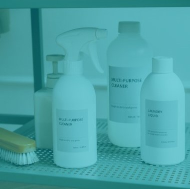
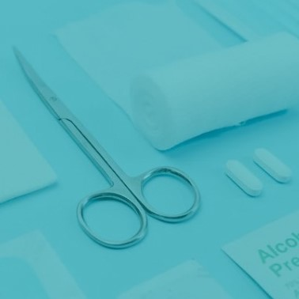

<!DOCTYPE html>
<html>
<meta name="viewport" content="width=device-width, initial-scale=1">

<head>
    
</head>

<body>
    
Categories

    

        

            <figure class=" gallery__item--1">
                <button class="btn">                  
                    
                    

                        
Medications

                    

                </button>
            </figure>
            <figure class=" gallery__item--2">
                <button class="btn">
                    
                    

                        
Vitamins

                    

                </button>
            </figure>
            <figure class="gallery__item--3">
                <button class="btn">
                    
                    

                        
Personal Care

                    

                </button>
            </figure>

            <figure class=" gallery__item--4">
                <button class="btn">
                    
                    

                        
Beauty Products

                    

                </button>
            </figure>

            <figure class=" gallery__item--5">
                <button class="btn">
                    
                    

                        
Skin Care

                    

                </button>
            </figure>
            <figure class=" gallery__item--6">
                <button class="btn">
                    
                    

                        
Cleaning products

                    

                </button>
            </figure>
            <figure class=" gallery__item--7">
                <button class="btn">
                    
                    

                        
Mother/Baby Care

                    

                </button>
            </figure>
            <figure class=" gallery__item--8">
                <button class="btn">
                    
                    

                        
Medical Suplments

                    

                </button>
            </figure>
            <figure class=" gallery__item--9">
                <button class="btn">

                    
                    

                        
Hair Care

                    

                </button>
            </figure>
            <figure class=" gallery__item--10">
                <button class="btn">
                    
                    

                        
Perfumes

                    

                </button>
            </figure>
        

    

</body>

</html>